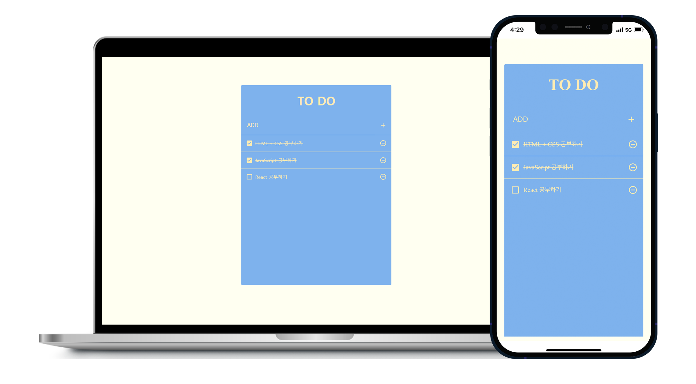
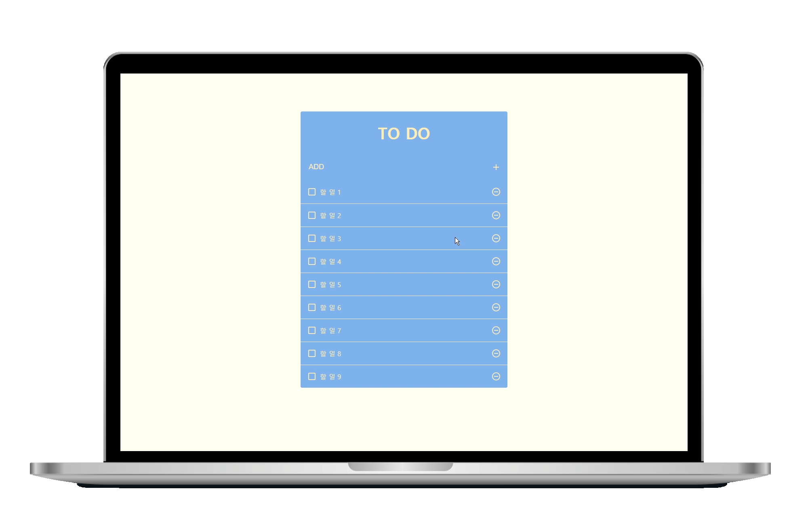

<div align="center"><h1>📃 TO-DO APP ✔</h1></div>

<div align="center">[Link] : https://geena-keem.github.io/todo-app/</div> 




**[Features]**

```
- 일정 항목 추가, 삭제, 토글 기능 구현
```

**[Project structure]**

```
.
├─ README.md
├─ jsconfig.json
├─ package.json
├─ public
│  ├─ favicon.ico
│  ├─ index.html
│  └─ ...
├─ src
│  ├─ App.css
│  ├─ App.js
│  ├─ App.test.js
│  ├─ components
│  │  ├─ TodoInsert.js
│  │  ├─ TodoInsert.scss
│  │  ├─ TodoList.js
│  │  ├─ TodoList.scss
│  │  ├─ TodoListItem.js
│  │  ├─ TodoListItem.scss
│  │  ├─ TodoTemplate.js
│  │  └─ TodoTemplate.scss
│  ├─ img
│  │  └─ ...
│  ├─ index.css
│  ├─ index.js
│  ├─ logo.svg
│  ├─ reportWebVitals.js
│  └─ ...
```

**[Technology]**

```
- JavaScript
- React.js
  ├─ node-sass
  ├─ classnames
  ├─ react-icons
  └─ react-virtualized
```

**[Reference]**

```
리액트를 다루는 기술
```
